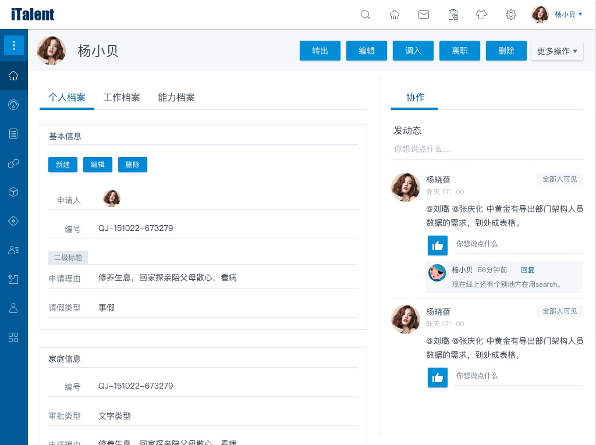

# detailpage
detailpage由pagemodule组成。

## 元数据
```javascript
{
	cmp_type:"DetailPage"
	,"cmp_data": {
		"metaObjectName": "",
		"viewName": "",
		"isShowTitle": false,
		"isDefault": false,
		"pageRenderType": "OnePage/TabPage",
		"dataID": "bccb8969-ba19-4023-aab3-77ec87fd4848"
	}
	,sub_cmps:[]
}
```
detailpage的渲染模式有两种：OnePage和TabPage。

下面是一个TabPage


## 例子
```javascript
{
    "cmp_id": "35bfb43f-baa4-4055-bb7c-24b3265bb2cc",
    "cmp_name": "BeisenCloudDemoyuanyuanBeisenCloudDemo_SupplyInfoDetail",
    "cmp_type": "DetailPage",
    "cmp_data": {
        "metaObjectName": "BeisenCloudDemo.SupplyInfo",
        "viewName": "BeisenCloudDemoyuanyuanBeisenCloudDemo.SupplyInfoDetail",
        "isShowTitle": false,
        "isDefault": false,
        "pageRenderType": "OnePage",
        "dataID": "bccb8969-ba19-4023-aab3-77ec87fd4848"
    },
    "layoutSets": [],
    "sub_cmps": [
        {
            "cmp_id": "35bfb43f-baa4-4055-bb7c-24b3265bb2cc_mainview",
            "cmp_name": "35bfb43f-baa4-4055-bb7c-24b3265bb2cc_mainview",
            "cmp_type": "DetailPageMainView",
            "cmp_data": {
                "metaObjectName": "BeisenCloudDemo.SupplyInfo",
                "viewName": "BeisenCloudDemoyuanyuanBeisenCloudDemo.SupplyInfoDetail",
                "title": "渚涘簲鍟嗕俊鎭�",
                "isShowTitle": true,
                "isDefault": false
            },
            "sub_cmps": {
                "cmp_type": null,
                "buttonList": {
                    "cmp_id": "2d8fd91e-eda2-4a0f-817f-178a91da50c3_ButtonList",
                    "cmp_name": "BeisenCloudDemo_SupplierCRUD_ButtonList",
                    "cmp_type": "ButtonList",
                    "cmp_data": {
                        "target": "BeisenCloudDemo_SupplierCRUD"
                    },
                    "sub_cmps": []
                },
                "form": {
                    "cmp_id": "2d8fd91e-eda2-4a0f-817f-178a91da50c3",
                    "cmp_name": "BeisenCloudDemo_SupplierCRUD",
                    "cmp_type": "Form",
                    "version": "0",
                    "viewName": "BeisenCloudDemo.SupplierCRUD",
                    "cmp_data": {
                        "metaObjectName": "BeisenCloudDemo.SupplyInfo",
                        "layout": null,
                        "cmp_state": "show",
                        "title": "渚涘簲鍟嗕俊鎭�",
                        "titleIcon": null,
                        "description": "渚涘簲鍟嗕俊鎭�",
                        "formState": "show",
                        "view": "",
                        "template": null,
                        "showTitle": true,
                        "context": {
                            "_metaObjID": "2d8fd91e-eda2-4a0f-817f-178a91da50c3",
                            "_objectDataID": "bccb8969-ba19-4023-aab3-77ec87fd4848"
                        }
                    },
                    "sub_cmps": [
                        {
                            "cmp_id": "2d8fd91e-eda2-4a0f-817f-178a91da50c3_part0",
                            "cmp_name": "BeisenCloudDemo_SupplierCRUD_part0",
                            "cmp_type": "FormPart",
                            "sub_cmps": [
                                {
                                    "cmp_id": "019301c0-2cf0-486e-ac2e-1d16dadc55ca",
                                    "cmp_name": "BeisenCloudDemoSupplyInfo_Name",
                                    "cmp_type": "BC_TextBox",
                                    "cmp_label": "渚涘簲鍟嗗悕绉�",
                                    "cmp_data": {
                                        "field_name": "Name",
                                        "cmp_state": "show",
                                        "cmp_status": "readonly",
                                        "editdisplaystate": "editable",
                                        "createdisplaystate": "editable",
                                        "showdisplaystate": "readonly"
                                    },
                                    "search_data": null,
                                    "biz_data": {
                                        "text": ""
                                    },
                                    "validators": [
                                        {
                                            "type": "required",
                                            "rule": "true",
                                            "message": "杈撳叆涓嶈兘涓虹┖"
                                        }
                                    ]
                                },
                                {
                                    "cmp_id": "32af3391-b655-4a9a-91d2-f0cb19812e89",
                                    "cmp_name": "BeisenCloudDemoSupplyInfo_Telephone",
                                    "cmp_type": "BC_TextBox",
                                    "cmp_label": "鑱旂郴鐢佃瘽",
                                    "cmp_data": {
                                        "field_name": "Telephone",
                                        "cmp_state": "show",
                                        "cmp_status": "readonly",
                                        "editdisplaystate": "editable",
                                        "createdisplaystate": "editable",
                                        "showdisplaystate": "readonly"
                                    },
                                    "search_data": null,
                                    "biz_data": {
                                        "text": ""
                                    },
                                    "validators": []
                                },
                                {
                                    "cmp_id": "fdd217a6-975e-448e-b954-ddea41899fbe",
                                    "cmp_name": "BeisenCloudDemoSupplyInfo_ContactUser",
                                    "cmp_type": "BC_TextBox",
                                    "cmp_label": "鑱旂郴浜�",
                                    "cmp_data": {
                                        "field_name": "ContactUser",
                                        "cmp_state": "show",
                                        "cmp_status": "readonly",
                                        "editdisplaystate": "editable",
                                        "createdisplaystate": "editable",
                                        "showdisplaystate": "readonly"
                                    },
                                    "search_data": null,
                                    "biz_data": {
                                        "text": ""
                                    },
                                    "validators": []
                                },
                                {
                                    "cmp_id": "41794439-6847-40e3-98b7-c02b7419e959",
                                    "cmp_name": "BeisenCloudDemoSupplyInfo_Adress",
                                    "cmp_type": "BC_TextBox",
                                    "cmp_label": "鍦板潃",
                                    "cmp_data": {
                                        "field_name": "Adress",
                                        "cmp_state": "show",
                                        "cmp_status": "readonly",
                                        "editdisplaystate": "editable",
                                        "createdisplaystate": "editable",
                                        "showdisplaystate": "readonly"
                                    },
                                    "search_data": null,
                                    "biz_data": {
                                        "text": ""
                                    },
                                    "validators": []
                                },
                                {
                                    "cmp_id": "d49140dd-8e67-4123-954e-1c5c11c31580",
                                    "cmp_name": "BeisenCloudDemoSupplyInfo_DockUser",
                                    "cmp_type": "BC_UserSelect",
                                    "cmp_label": "瀵规帴浜�",
                                    "cmp_data": {
                                        "singleSelect": false,
                                        "field_name": "DockUser",
                                        "cmp_state": "show",
                                        "cmp_status": "readonly",
                                        "editdisplaystate": "editable",
                                        "createdisplaystate": "editable",
                                        "showdisplaystate": "readonly",
                                        "datasourcename": "BCStaffDataSource"
                                    },
                                    "search_data": null,
                                    "biz_data": {
                                        "text": ""
                                    },
                                    "validators": []
                                },
                                {
                                    "cmp_id": "8304f860-f638-4757-9c8c-33d86faf6a07",
                                    "cmp_name": "BeisenCloudDemoSupplyInfo_faren",
                                    "cmp_type": "BC_TextBox",
                                    "cmp_label": "娉曚汉",
                                    "cmp_data": {
                                        "field_name": "faren",
                                        "cmp_state": "show",
                                        "cmp_status": "readonly",
                                        "editdisplaystate": "editable",
                                        "createdisplaystate": "editable",
                                        "showdisplaystate": "readonly"
                                    },
                                    "search_data": null,
                                    "biz_data": {
                                        "text": ""
                                    },
                                    "validators": []
                                }
                            ],
                            "cmp_data": {
                                "showTitle": true,
                                "label": "渚涘簲鍟嗕俊鎭�",
                                "templateName": "DefaultPartTitle",
                                "createdisplaystate": "editable",
                                "editdisplaystate": "editable",
                                "showdislaystate": "readonly",
                                "maxColumnCount": 1,
                                "visible": true
                            }
                        }
                    ],
                    "biz_data": [
                        {
                            "_id": {
                                "name": "_id",
                                "text": "bccb8969-ba19-4023-aab3-77ec87fd4848",
                                "value": "bccb8969-ba19-4023-aab3-77ec87fd4848"
                            },
                            "BeisenCloudDemoSupplyInfo_DockUser": {
                                "name": "BeisenCloudDemoSupplyInfo_DockUser",
                                "text": "寮犳椇(zhangwang@beisen.com)",
                                "value": "100372952"
                            },
                            "BeisenCloudDemoSupplyInfo_Name": {
                                "name": "BeisenCloudDemoSupplyInfo_Name",
                                "text": "鑵捐",
                                "value": "鑵捐"
                            },
                            "BeisenCloudDemoSupplyInfo_ModifiedTime": {
                                "name": "BeisenCloudDemoSupplyInfo_ModifiedTime",
                                "text": "2016/03/30 19:15:11",
                                "value": "3/30/2016 7:15:11 PM"
                            },
                            "BeisenCloudDemoSupplyInfo_faren": {
                                "name": "BeisenCloudDemoSupplyInfo_faren",
                                "text": null,
                                "value": null
                            },
                            "BeisenCloudDemoSupplyInfo_CreatedTime": {
                                "name": "BeisenCloudDemoSupplyInfo_CreatedTime",
                                "text": "2016/03/22 09:58:25",
                                "value": "3/22/2016 9:58:25 AM"
                            },
                            "BeisenCloudDemoSupplyInfo_ModifiedBy": {
                                "name": "BeisenCloudDemoSupplyInfo_ModifiedBy",
                                "text": "100372825",
                                "value": "100372825"
                            },
                            "BeisenCloudDemoSupplyInfo_Name_Pinyin": {
                                "name": "BeisenCloudDemoSupplyInfo_Name_Pinyin",
                                "text": null,
                                "value": null
                            },
                            "BeisenCloudDemoSupplyInfo_suozaidiqu": {
                                "name": "BeisenCloudDemoSupplyInfo_suozaidiqu",
                                "text": null,
                                "value": null
                            },
                            "BeisenCloudDemoSupplyInfo_CreatedBy": {
                                "name": "BeisenCloudDemoSupplyInfo_CreatedBy",
                                "text": "100372825",
                                "value": "100372825"
                            },
                            "BeisenCloudDemoSupplyInfo_Adress": {
                                "name": "BeisenCloudDemoSupplyInfo_Adress",
                                "text": "娣卞湷",
                                "value": "娣卞湷"
                            },
                            "BeisenCloudDemoSupplyInfo_ContactUser": {
                                "name": "BeisenCloudDemoSupplyInfo_ContactUser",
                                "text": "椹寲鑵�",
                                "value": "椹寲鑵�"
                            },
                            "BeisenCloudDemoSupplyInfo_Telephone": {
                                "name": "BeisenCloudDemoSupplyInfo_Telephone",
                                "text": "010-22222222",
                                "value": "010-22222222"
                            }
                        }
                    ]
                }
            }
        }
    ]
}
```